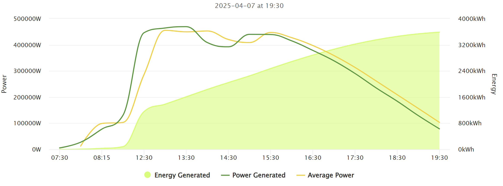
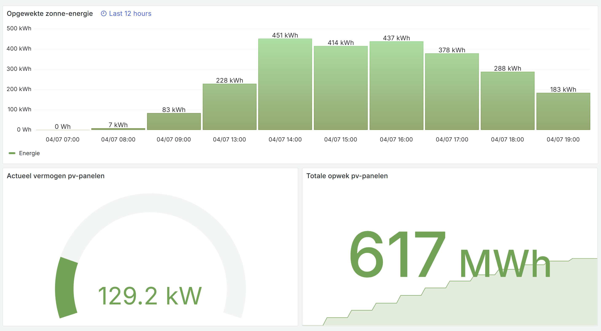

# Huawei FusionSolar (Northbound OpenAPI and/or Kiosk) to InfluxDB, MQTT, PVOutput and Home Assistant relay
This is a python project intended to fetch data from the FusionSolar **Northbound OpenAPI** or public **kiosk**, and relay it to **InfluxDB**/**VictoriaMetrics** and/or **PVOutput.org** and/or **MQTT** and/or **Home Assistant (hass)**. Both inverter and grid meter metrics can be retrieved from FusionSolar's API.

Additionally this project can also fetch and relay utility grid energy usage data from the Dutch **Kenter** metering service for commercial transformers.

Multiple parallel fusionsolar kiosk configurations are supported, and multiple devices on the *same* Northbound OpenAPI account are supported. Also, multiple parallel meters from Kenter's service are supported as well. You can configure where metrics should be published per configured device. Additionally, the project also supports publishing metrics from discovered devices over the Northbound API, which have not been individually configured in the environment variables. Please refer to settings the configuration options in this document for more explanation.

# Installation
This project is mostly used as a Docker container and fetches its config from environment variables. The file `main.py` can also be started from a python3 environment, after running `pip install -r requirements.txt` and renaming `.env.example` to `.env`. PyFusionSolarDataRelay will then load the environment files from this file, overriding any environment variables already set.

Check out [examples/docker-compose.yml](https://github.com/JasperE84/PyFusionSolarDataRelay/blob/main/examples/docker-compose.yml) for a docker configuration example.

# Breaking changes in the latest release
In version 2.0.0 the environment variables used by this project changed names and structure. Please review the configuration section in README for updated variable names. Additionaly, functionality to write electrical energy usage from utility grid has been removed.

# About Huawei FusionSolar Northbound OpenAPI mode
FusionSolar is Huawei's online monitoring platform, the Northbound API exposes metrics from devices supported by this platform. This project specifically supports inverter and grid meter device types. To use the Northbound API (also called OpenAPI) please ask your installer to create an API account for you, with read access to the relevant inverter and grid meter (if applicable) metrics.

# About Huawei FusionSolar Kiosk mode
FusionSolar features a kiosk mode. When enabled, a kiosk url is generated which is publically accessible. The kiosk web app fetches its data from a JSON backend. It is this backend where this project fetches the PV data. Fetching data from the kiosk mode can be beneficial to those without direct access to the official API and/or the inverter Modbus-TCP. For instance when the inverter is logging to fusionsolar over a direct cellular connection configured and fitted by an installer unable to provide API access rights to third parties.

# About PVOutput.org
[PVOutput.org](https://pvoutput.org/) is a free service for sharing and comparing PV output data.

# About InfluxDB
[InfluxDB](https://www.influxdata.com/) is an open source time series database on which dashboards can easily be built. For instance using [Grafana](https://grafana.com/)

# About MQTT
MQTT is an OASIS standard messaging protocol for the Internet of Things (IoT). It is designed as an extremely lightweight publish/subscribe messaging transport that is ideal for connecting remote devices. MQTT can be used to relay the PV data to various home automation software such as [Home Assistant](https://www.home-assistant.io/)

# About Home Assistant
Home Assistant (hass) is an open source home automation platform. Hass features an energy dashboard in which energy generation, storage and usage data can be combined in a dashboard giving a total overview of energy flow. Using MQTT, the power and energy generation data from Huawei's FusionSolar Kiosk can be fed into Home Assistant. This project can then act as a data source for the solar production section of the HASS energy dashboard.

Hass can easily be connected to an MQTT using the MQTT integration, which can be set up using the hass web interface. Once hass is connected to MQTT, PyFusionSolarDataRelay publishes a HASS MQTT device discovery topic so that home assistant automatically recognizes the devices for which measurements are relayed. No configuration in home assistant sensors is required.

Once everything is configured, solar data will flow as follows: 

`[FusionSolar (Kiosk/Northbound) API] --> [PyFusionSolarDataRelay] --> [MQTT Server] --> [Home Assistant]`

For those of you using Docker, a docker-compose.yml file is provided [here](./examples/docker-compose.yml) in order to get these different components up and running quickly.

# About Kenter's klantportaal.kenter.nu
Kenter provides measurement services for **commercially rented** grid transformers. This project can fetch energy usage data from this API and post it to InfluxDB. MQTT/PVOutput is not supported for posting Kenter data, as Kenter's latest measurement data is usually 3 days old and PVOutput imposes challenges on having the datapoint timestamps between grid usage and PV output synchronous. 

# Configuration settings documentation
## General settings
| Parameter | Description | Default |
| --- | --- | --- |
| debug_mode | Enables verbose logging | False |
| fetch_on_startup | Starts API fetching and processing on startup one, then schedule cron jobs | False |
| site_descriptive_name | Descriptive name for complete site. Use lowercase, and no special characters. This will be used for MQTT topics and InfluxDB record tags | site01 |

## Kiosk settings
| Parameter | Description | Default |
| --- | --- | --- |
| fusionsolar_kiosk_module_enabled | Can be `True` or `False`, determines if fusionsolar kiosk API functionality is enabled | True |
| fusionsolar_kiosk_fetch_cron_hour | Hour component for python cron job to fetch and process data from fusionsolar. | * |
| fusionsolar_kiosk_fetch_cron_minute | Minute component for python cron job to fetch and process data from fusionsolar | 0,30 |
| fusionsolar_kiosks__0__descriptive_name | Descriptive name for PV system for which this kiosk entity provides data. Use lowercase, and no special characters. This will be used for InfluxDB record tags | inverter01 |
| fusionsolar_kiosks__0__enabled | To disable individual kiosk configurations. Can be `True` or `False` | True |
| fusionsolar_kiosks__0__api_url | Link to the fusionsolar kiosk data backend, multiple records supported by adding an extra param with `__1__` etc. | [Click url](https://region01eu5.fusionsolar.huawei.com/rest/pvms/web/kiosk/v1/station-kiosk-file?kk=) |
| fusionsolar_kiosks__0__api_kkid | Unique kiosk ID, can be found by looking the kiosk URL and then taking the code after `kk=` | GET_THIS_FROM_KIOSK_URL |
| fusionsolar_kiosks__0__output_influxdb | Write to influxdb if influx module enabled. Can be `True` or `False` | True |
| fusionsolar_kiosks__0__output_mqtt | Write to mqtt if mqtt module enabled. Can be `True` or `False` | True |
| fusionsolar_kiosks__0__output_pvoutput | If pvoutput_module_enabled then write this pv metric to pvoutput | `False` |
| fusionsolar_kiosks__0__output_pvoutput_system_id | System ID for PVOutput.org, should be numeric | 0 |

## General Northbound OpenAPI settings
| Parameter | Description | Default |
| --- | --- | --- |
| fusionsolar_open_api_module_enabled | Can be `True` or `False`, determines if fusionsolar OpenAPI functionality is enabled | True |
| fusionsolar_open_api_url | Link to the fusionsolar OpenAPI data backend. | [Click url](https://eu5.fusionsolar.huawei.com) |
| fusionsolar_open_api_user_name | Username for FusionSolar Northbound OpenAPI. |  |
| fusionsolar_open_api_system_code | Password for FusionSolar Northbound OpenAPI. |  |
| fusionsolar_open_api_cron_hour | Hour component for python cron job to fetch and process data from fusionsolar. | * |
| fusionsolar_open_api_cron_minute | Minute component for python cron job to fetch and process data from fusionsolar | */5 |
| fusionsolar_open_api_mqtt_for_discovered_dev | Write KPI's to MQTT for devices discovered over the API without a matching dev_id | True |
| fusionsolar_open_api_influxdb_for_discovered_dev | Write KPI's to InfluxDB for devices discovered over the API without a matching dev_id | True |
### Inverter Northbound OpenAPI settings
| Parameter | Description | Default |
| --- | --- | --- |
| fusionsolar_open_api_inverters__0__descriptive_name | Descriptive name for inverter. Use lowercase, and no special characters. This will be used for InfluxDB record tags | inverter01 |
| fusionsolar_open_api_inverters__0__enabled | To disable individual OpenAPI inverter configurations. Can be `True` or `False` | True |
| fusionsolar_open_api_inverters__0__dev_id | Unique device ID nr, can be found by inspecting ./cache/fusion_solar_openapi_devices.json or inspecting stdout logs after startup | |
| fusionsolar_open_api_inverters__0__output_influxdb | Write to influxdb if influx module enabled. Can be `True` or `False` | True |
| fusionsolar_open_api_inverters__0__output_mqtt | Write to mqtt if mqtt module enabled. Can be `True` or `False` | True |
| fusionsolar_open_api_inverters__0__output_pvoutput | If pvoutput_module_enabled then write this pv metric to pvoutput | `False` |
| fusionsolar_open_api_inverters__0__output_pvoutput_system_id | System ID for PVOutput.org, should be numeric | 0 |
### Grid Meter Northbound OpenAPI settings
| Parameter | Description | Default |
| --- | --- | --- |
| fusionsolar_open_api_meters__0__descriptive_name | Descriptive name for grid meter. Use lowercase, and no special characters. This will be used for InfluxDB record tags | meter01 |
| fusionsolar_open_api_meters__0__enabled | To disable individual OpenAPI meter configurations. Can be `True` or `False` | True |
| fusionsolar_open_api_meters__0__dev_id | Unique device ID nr, can be found by inspecting ./cache/fusion_solar_openapi_devices.json or inspecting stdout logs after startup | |
| fusionsolar_open_api_meters__0__output_influxdb | Write to influxdb if influx module enabled. Can be `True` or `False` | True |
| fusionsolar_open_api_meters__0__output_mqtt | Write to mqtt if mqtt module enabled. Can be `True` or `False` | True |
## Kenter metering settings
| Parameter | Description | Default |
| --- | --- | --- |
| kenter_module_enabled | Can be `True` or `False`, determines if data is fetched from Kenter's klantportaal.kenter.nu API | False |
| kenter_api_url | Kenter API url for fetching transformer grid measurements | [Click url](https://api.kenter.nu) |
| kenter_token_url | Kenter API url for fetching auth token | [Click url](https://login.kenter.nu/connect/token) |
| kenter_clientid | Username for Kenter's API | user |
| kenter_password | Password for Kenter's API | passwd |
| kenter_fetch_cron_hour | Hour component for python cron job to fetch and process data from Kenter. | 8 |
| kenter_fetch_cron_minute | Minute component for python cron job to fetch and process data from Kenter | 0 |
| kenter_days_back | Kenter's klantportaal.kenter.nu does not provide live data. Data is only available up until an X amount of days back. May vary per transformer. | 1 |
| kenter_days_backfill | How many additional days before days_back to process on startup  | 0 |
| kenter_metering_points__0__descriptive_name | Descriptive name for transformer. Use lowercase, and no special characters. This will be used for MQTT topics and InfluxDB record tags | transformer01 |
| kenter_metering_points__0__connection_id | ConnectionId as shown in meter list on startup stdout (EAN code) | XXX |
| kenter_metering_points__0__metering_point_id | MeteringPointId as shown in meter list on startup stdout | XXX |
| kenter_metering_points__0__channel_id | See kenter API docs, 16180 is delivery for allocation with transformer correction factor for billing, 10180 is delivery kWh from an individual meter | 16180 |
| kenter_metering_points__0__output_influxdb | Write to influxdb if influx module enabled. Can be `True` or `False` | True |
## Influxdb / VictoriaMetrics settings
| Parameter | Description | Default |
| --- | --- | --- |
| influxdb_module_enabled | Can be `True` or `False`, determines if InfluxDB processing is enabled | False |
| influxdb_is_v2 | If `True` the InfluxDBv2 methods are used. If `False` InfluxDBv1 methods are used | True |
| influxdb_host | Hostname of the influxdb server | localhost |
| influxdb_port | Port of influxdb server | 8086 |
| influxdb_v1_db_name | Database name for InfluxDBv1, only required if influx2=False | fusionsolar |
| influxdb_v1_username | Username for InfluxDBv1, only required if influx2=False | fusionsolar |
| influxdb_v1_password | Password for InfluxDBv1, only required if influx2=False | fusionsolar |
| influxdb_v2_protocol | Protocol for InfluxDBv2, can be `https` or `http`, only required if influx2=True | https |
| influxdb_v2_org | Organization for InfluxDBv2, only required if influx2=True | acme |
| influxdb_v2_bucket | Bucket for InfluxDBv2, only required if influx2=True | fusionsolar |
| influxdb_v2_token | Token for InfluxDBv2, only required if influx2=True | XXXXXXX |
## PVOutput.org settings
| Parameter | Description | Default |
| --- | --- | --- |
| pvoutput_module_enabled | Can be `True` or `False`, determines if PVOutput.org API is enabled | False |
| pvoutput_record_url | API url for PVOutput.org live output posting | [Click url](https://pvoutput.org/service/r2/addstatus.jsp)
| pvoutput_api_key | API Key for PVOutput.org | yourapikey |
## MQTT settings
| Parameter | Description | Default |
| --- | --- | --- |
| mqtt_module_enabled | Can be `True` or `False`, determines if MQTT publishing is enabled | False |
| mqtt_host | Hostname of MQTT server | localhost |
| mqtt_port | Port of MQTT server | 1883 |
| mqtt_auth | Can be `True` or `False`, determines if MQTT authentication is enabled | False |
| mqtt_username | MQTT Username | fusionsolar |
| mqtt_password | MQTT Password | fusionsolar |
| mqtt_root_topic | MQTT Topic for publishing | pyfusionsolar |
| mqtt_hass_discovery_enabled | Automatically publish all sensors in MQTT home assistant device discovery | True |

# Grafana dashboard example
A [grafana dashboard export](./examples/grafana-dashboard-export.json) is included in the examples subfolder in the Git repository.

# Grafana solar PV dashboard elements on Xibo digital signage system
I'm using individual the elements on this dashboard to show the PV solar statistics on a free and open source [Xibo Digital Signage](https://xibo.org.uk/) narrowcasting system. 

Take the following steps to achieve this:
1. Enable Grafana anonymous mode (see [examples/docker-compose.yml](https://github.com/JasperE84/PyFusionSolarDataRelay/blob/main/examples/docker-compose.yml))
2. Create a new layout in Xibo and add some regions, or import the [example Xibo layout](./examples/xibo-export-pv-triptych-v2-1080p.zip).
3. Back in Grafana, open the dashboard and click 'Share' in the grafana individual graph dropdown dialog (not the entire dashboard, but the individual graph on the dashboard)
4. Share in "Link" mode (do not use snapshot or embed)
5. Back in Xibo, drop the "Webpage" widget on your region, or select the existing widget in the imported example layout.
6. Configure the webpage widget to show the link copied in step 4.
7. Optionally alter the url to format like `&from=now-12h` instead of the default `&from=1655015379544&to=1655058579544`
7. Publish the layout, the graphs will now fit nicely in the width/height of the defined regions.

# Changelog
| Version | Description |
| --- | --- |
| 2.0.3 | Bugfix in scheduler |
| 2.0.2 | Default to kW in home assistant with 3 digit precision suggestion |
| 2.0.1 | Now sending MQTT device discovery message |
| 2.0.1 | Bugfix in environment variable parsing for custom pydantic nested env list parser |
| 2.0.0 | Introduced possibility to configure multiple input sources (kiosks, openapi meters/inverters and kenter meters) |
| 2.0.0 | Implemented Huawei Northbound OpenAPI as data source for metrics |
| 2.0.0 | Now supporting Kenter API v2 |
| 2.0.0 | Removed currentPower kiosk property (fetched from powercurve API obj) in favor of realTimePower |
| 2.0.0 | Removed functionality to write utility grid consumption (non-pv) to PVOutput (InfluxDB fully supported!) |
| 2.0.0 | **BREAKING CHANGE:** Environment variables for config changed names and structure. Please review the configuration section in README for updated variable names |
| 2.0.0 | Refactored class names and .py file structure |
| 2.0.0 | Implemented pydantic to replace pvconf.py, now supporting non-environment variable based settings using config.yaml |
| 1.0.6 | Fixed a bug  parsing the environment cron settings, which are in string format, but were interpreted as int, causing an exception |
| 1.0.6 | FusionSolar API will now immediately be queried on startup if debug mode is enabled (so no waiting for cron to trigger is required for testing) |
| 1.0.5 | Added InfluxDB support for an optional secondary grid telemetry EAN configuration (pvoutput output is only supported on the primary EAN) |
| 1.0.5 | Bugfix for InfluxDB v1 implementation and removed auto-database creation for VictoriaMetrics compatibility |
| 1.0.3 | Grid transformer usage measurement polling from Kenter's klantportaal.kenter.nu API has been implemented |
| 1.0.3 | Changed docker-compose.yml template not to use host networking mode |
| 1.0.3 | main.py now uses separate threads for RelayFusionSolar and RelayKenter classes |
| 1.0.3 | Implemented apscheduler's cron implementation to be able to specify exact moments to fetch fusionsolar data |
| 1.0.3 | Code and method name refactoring including PvConf type hints in classes where this class was injected as method parameter |

Released under [MIT](/LICENSE) by [@JasperE84](https://github.com/JasperE84).

This project has been partly developed in time donated by [Contour - Sheet metal supplier](https://www.contour.eu/en/)

Dit project is deels ontwikkeld ontwikkeld in de tijd van [Contour - Plaatwerkleverancier](https://www.contour.eu/)
