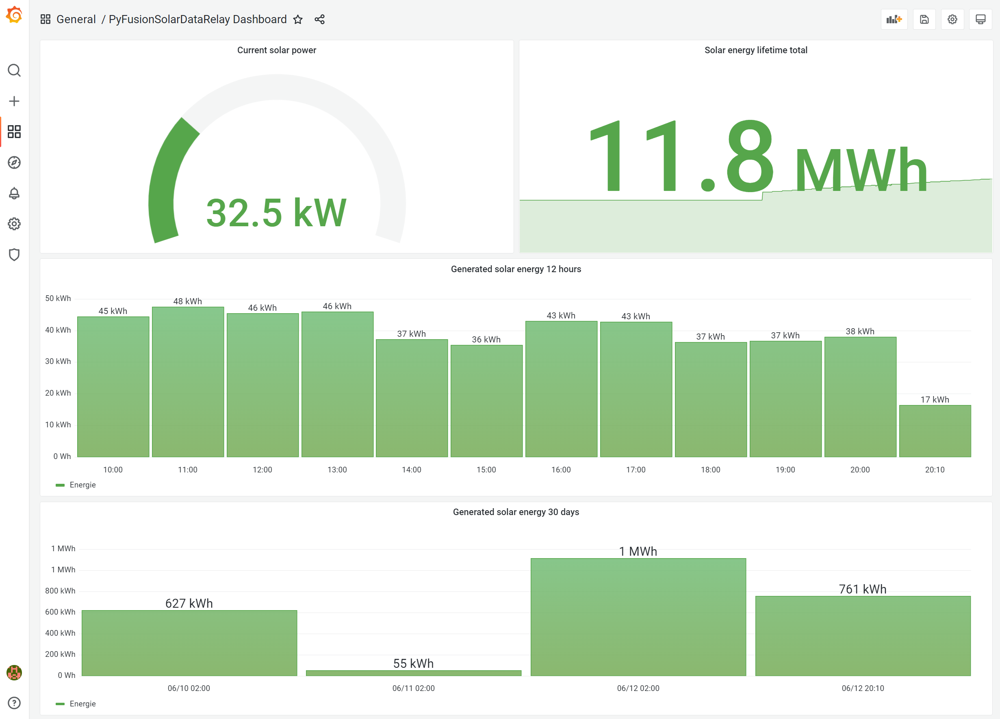
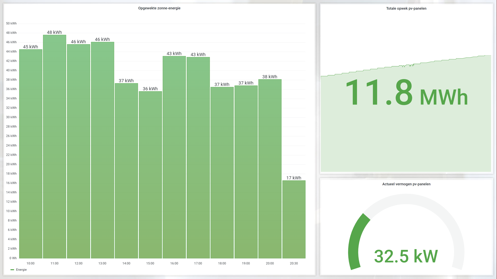

# Huawei FusionSolar Kiosk to InfluxDB, MQTT, PVOutput and Home Assistant relay
This is a python project intended to fetch data from the **Huawei FusionSolar** public **kiosk** and relay it to **InfluxDB** and/or **PVOutput.org** and/or **MQTT** and/or **Home Assistant (hass)**. 

Additionally this project can also fetch and relay grid usage data from the Dutch meetdata.nl API provider by **Kenter**.

Credits go to the [Grott project](https://github.com/johanmeijer/grott). Many bits of code, structure and ideas are borrowed from there.

# Installation
This project is currently intented to run as a Docker container and fetches its config from environment variables. Yet the project can be run standalone. 
A local settings file (such as .yml or .ini) has not been implemented yet, but pvconf.py can easily be modified to override standard settings.

Check out [Examples/docker-compose.yml](https://github.com/JasperE84/PyFusionSolarDataRelay/blob/main/Examples/docker-compose.yml) for a docker configuration example.

# Breaking changes in the release
The fusionsolarinterval configuration paramters has been replaced by two cron settings defaulting to poll fusionsolar data each half our.

# About Huawei FusionSolar Kiosk mode
FusionSolar is Huawei's online monitoring platform for their PV inverters. FusionSolar features a kiosk mode. When enabled, a kiosk url is generated which is publically accessible. The kiosk web app fetches its data from a JSON backend. It is this backend where this project fetches the PV data. 
Fetching data from the kiosk mode can be beneficial to those without direct access to the official API and/or the inverter Modbus-TCP. For instance when the inverter is logging to fusionsolar over a direct cellular connection configured and fitted by an installer unable to provide API access rights to third parties.

# About PVOutput.org
[PVOutput.org](https://pvoutput.org/) is a free service for sharing and comparing PV output data.

# About InfluxDB
[InfluxDB](https://www.influxdata.com/) is an open source time series database on which dashboards can easily be built. For instance using [Grafana](https://grafana.com/)

# About MQTT
MQTT is an OASIS standard messaging protocol for the Internet of Things (IoT). It is designed as an extremely lightweight publish/subscribe messaging transport that is ideal for connecting remote devices. MQTT can be used to relay the PV data to various home automation software such as [Home Assistant](https://www.home-assistant.io/)

# About Home Assistant
Home Assistant (hass) is an open source home automation platform. Hass features an energy dashboard in which energy generation, storage and usage data can be combined in a dashboard giving a total overview of energy flow. Using MQTT, the power and energy generation data from Huawei's FusionSolar Kiosk can be fed into Home Assistant. This project can then act as a data source for the solar production section of the HASS energy dashboard.

Hass can easily be connected to an MQTT using the MQTT integration, which can be set up using the hass web interface. Once hass is connected to MQTT, a change in configuration.yaml is required in order to add the energy sensors to hass. A [configuration.yaml example file](./Examples/configuration.yaml) which shows how to do this is provided in the Examples subfolder of this project. 

Once everything is configured, solar data will flow as follows: 

`[FusionSolar Kiosk API] --> [PyFusionSolarDataRelay] --> [MQTT Server] --> [Home Assistant]`

For those of you using Docker, a docker-compose.yml file is provided [here](./Examples/docker-compose.yml) in order to get these different components up and running quickly.

# About Kenter's meetdata.nl
Kenter provides measurement services for **commercially rented** grid transformers. This project can fetch energy usage data from this API and post it to InfluxDB and PVOutput. MQTT is not supported for posting Kenter data, as Kenter's latest measurement data is usually 3 days old.

# About Kenter's API and matching PVOutput intervals
Fusion solar data fetching is planned by cron in order to exactly specify at what times the data should reload. This way, it is possible to synchronise the intervals of fusionsolar and gridkenter datapoints, which end up showing on PVOutput. That's relevant because if the gridkenter data class is fetched, meetdata.nl does not provide live measurements. Instead it provides historic measurements with a certain interval (15 minutes interval with the most recent data point 3 days old in my case). If this interval doesn't match the fusionsolar interval, then PVOutput will show distorted graphs because it won't have a datapoint for both PV production and grid usage for each interval. (Fusionsolar kiosk API only updates each half hour). See [this url](https://crontab.guru/) for help with finding the right cron config.

# Configuration parameter documentation
| Parameter | Environment variable | Description | Default |
| --- | --- | --- | --- |
| debug | pvdebug | Enables verbose logging | True |
| pvsysname | pvsysname | Definition of 'measurement' name for InfluxDB | inverter01 |
| fusionsolar | pvfusionsolar | Can be `True` or `False`, determines if fusionsolar kiosk API is enabled | True |
| fusionsolarurl | pvfusionsolarurl | Link to the fusionsolar kiosk data backend | [Click url](https://region01eu5.fusionsolar.huawei.com/rest/pvms/web/kiosk/v1/station-kiosk-file?kk=) |
| fusionsolarkkid | pvfusionsolarkkid | Unique kiosk ID, can be found by looking the kiosk URL and then taking the code after `kk=` | GET_THIS_FROM_KIOSK_URL |
| fusionhourcron | pvfusionhourcron | Hour component for python cron job to fetch and process data from fusionsolar. | * |
| fusionminutecron | pvfusionminutecron | Minute component for python cron job to fetch and process data from fusionsolar | 0,30 |
| pvoutput | pvpvoutput | Can be `True` or `False`, determines if PVOutput.org API is enabled | False |
| pvoutputapikey | pvpvoutputapikey | API Key for PVOutput.org | yourapikey |
| pvoutputsystemid | pvpvoutputsystemid | System ID for PVOutput.org, should be numeric | 12345 |
| pvoutputurl | pvpvoutputurl | API url for PVOutput.org live output posting | [Click url](https://pvoutput.org/service/r2/addstatus.jsp)
| pvoutputbatchurl | pvpvoutputbatchurl | API url for PVOutput.org historic data batch posting (used for grid data from meetdata.nl) | [Click url](https://pvoutput.org/service/r2/addbatchstatus.jsp)
| influx | pvinflux | Can be `True` or `False`, determines if InfluxDB processing is enabled | False |
| influx2 | pvinflux2 | If `True` the InfluxDBv2 methods are used. If `False` InfluxDBv1 methods are used | True |
| ifhost | pvifhost | Hostname of the influxdb server | localhost |
| ifport | pvifport | Port of influxdb server | 8086 |
| if1dbname | pvif1dbname | Database name for InfluxDBv1, only required if influx2=False | fusionsolar |
| if1user | pvif1user | Username for InfluxDBv1, only required if influx2=False | fusionsolar |
| if1passwd | pvif1passwd | Password for InfluxDBv1, only required if influx2=False | fusionsolar |
| if2protocol | pvif2protocol | Protocol for InfluxDBv2, can be `https` or `http`, only required if influx2=True | https |
| if2org | pvif2org | Organization for InfluxDBv2, only required if influx2=True | acme |
| if2bucket | pvif2bucket | Bucket for InfluxDBv2, only required if influx2=True | fusionsolar |
| if2token | pvif2token | Token for InfluxDBv2, only required if influx2=True | XXXXXXX |
| mqtt | pvmqtt | Can be `True` or `False`, determines if MQTT publishing is enabled | False |
| mqtthost | pvmqtthost | Hostname of MQTT server | localhost |
| mqttport | pvmqttport | Port of MQTT server | 1883 |
| mqttauth | pvmqttauth | Can be `True` or `False`, determines if MQTT authentication is enabled | False |
| mqttuser | pvmqttuser | MQTT Username | fusionsolar |
| mqttpasswd | pvmqttpasswd | MQTT Password | fusionsolar |
| mqtttopic | pvmqtttopic | MQTT Topic for publishing | energy/pyfusionsolar |
| gridrelay | pvgridrelay | Can be `True` or `False`, determines if data is fetched from Kenter's meetdata.nl API | False |
| gridrelayinterval | pvgridrelayinterval | Interval in seconds to fetch data from meetdata.nl and post to PVOutput and InfluxDB | 43200 |
| gridrelaykenterurl | pvgridrelaykenterurl | Kenter API url for fetching transformer grid measurements | [Click url](https://webapi.meetdata.nl) |
| gridrelaykenteruser | pvgridrelaykenteruser | Username for Kenter's API | user |
| gridrelaykenterpasswd | pvgridrelaykenterpasswd | Password for Kenter's API | passwd |
| gridrelaydaysback | pvgridrelaydaysback | Kenter's meetdata.nl does not provide live data. Data is only available up until an X amount of days back. May vary per transformer. | 3 |
| gridrelaypvoutputspan | pvgridrelaypvoutputspan | In my case meetdata.nl has datapoints for each 15mins. Setting this to a value of 2, will calculate averages over 2 datapoints spanning half an hour before posting to PVOutput. This way the datapoint interval between the grid usage data and fusionsolar PV production data matches, resulting in nice diagrams on PVOutput.org | 2 |
| gridrelaysysname | pvgridrelaysysname | Grid transformer name for InfluxDB transformer data | transformer01 |
| gridrelaykenterean | pvgridrelaykenterean | EAN code for transformer on Kenter's www.meetdata.nl | XXX |
| gridrelaykentermeterid | pvgridrelaykentermeterid | MeterID as shown on Kenter's www.meetdata.nl | XXX |
| gridrelaysys02enabled | pvgridrelaysys02enabled | Can be `True` or `False`, determines if a secondary transformer is configured for InfluxDB output | False |
| gridrelaysysname02 | pvgridrelaysysname02 | Grid transformer name for InfluxDB transformer data | transformer02 |
| gridrelaykenterean02 | pvgridrelaykenterean02 | EAN code for transformer on Kenter's www.meetdata.nl | XXX |
| gridrelaykentermeterid02 | pvgridrelaykentermeterid02 | MeterID as shown on Kenter's www.meetdata.nl | XXX |

# Grafana dashboard example
A grafana dashboard export is included in the Examples subfolder in the Git repository.

# Grafana solar PV dashboard elements on Xibo digital signage system
I'm using individual the elements on this dashboard to show the PV solar statistics on a free and open source [Xibo Digital Signage](https://xibo.org.uk/) narrowcasting system. 

Take the following steps to achieve this:
1. Enable Grafana anonymous mode (see [Examples/docker-compose.yml](https://github.com/JasperE84/PyFusionSolarDataRelay/blob/main/Examples/docker-compose.yml))
2. Create a new layout in Xibo and add some regions
3. Back in Grafana, open the dashboard and click 'Share' in the grafana individual graph dropdown dialog (not the entire dashboard, but the individual graph on the dashboard)
4. Share in "Link" mode (do not use snapshot or embed)
5. Back in Xibo, drop the "Webpage" widget on your region
6. Configure the webpage widget to show the link copied in step 4.
7. Optionally alter the url to format like `&from=now-12h` instead of the default `&from=1655015379544&to=1655058579544`
7. Publish the layout, the graphs will now fit nicely in the width/height of the defined regions.

Result:

# Changelog
| Version | Description |
| --- | --- |
| 1.0.5 | Added InfluxDB support for an optional secondary grid telemetry EAN configuration (pvoutput output is only supported on the primary EAN) |
| 1.0.5 | Bugfix for InfluxDB v1 implementation and removed auto-database creation for VictoriaMetrics compatibility |
| 1.0.3 | Grid transformer usage measurement polling from Kenter's meetdata.nl API has been implemented |
| 1.0.3 | Changed docker-compose.yml template not to use host networking mode |
| 1.0.3 | pv.py now uses separate threads for PvRelay and GridRelay classes |
| 1.0.3 | Implemented apscheduler's cron implementation to be able to specify exact moments to fetch fusionsolar data |
| 1.0.3 | Code and method name refactoring including PvConf type hints in classes where this class was injected as method parameter |

Released under [MIT](/LICENSE) by [@JasperE84](https://github.com/JasperE84).

This project has been partly developed in time donated by [Contour - Sheet metal supplier](https://www.contour.eu/en/)

Dit project is deels ontwikkeld ontwikkeld in de tijd van [Contour - Plaatwerkleverancier](https://www.contour.eu/)
